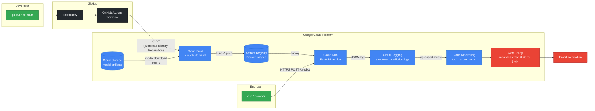
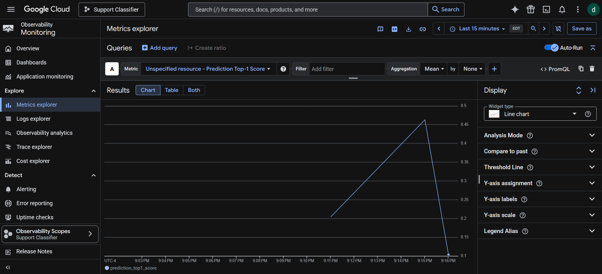

# Support Ticket Intent Classifier


Production-grade MLOps pipeline: a fine-tuned DistilBERT model classifying customer support text into 77 banking intents, deployed to Google Cloud Run via fully-automated CI/CD with monitoring and drift detection.

**Live endpoint:** [https://support-classifier-weguu3yhnq-uc.a.run.app](https://support-classifier-weguu3yhnq-uc.a.run.app/docs)
*(Auto-generated Swagger UI for interactive testing)*

## Architecture



## What it does

A REST API that classifies short customer-support text into one of 77 banking intents from the [PolyAI/banking77](https://huggingface.co/datasets/PolyAI/banking77) dataset (e.g. `card_not_working`, `transfer_fee_charged`, `lost_or_stolen_card`, `terminate_account`).

```bash
curl -X POST https://support-classifier-weguu3yhnq-uc.a.run.app/predict \
  -H "Content-Type: application/json" \
  -d '{"text": "my card is broken and I need a new one", "top_k": 3}'
```

```json
{
  "text": "my card is broken and I need a new one",
  "predictions": [
    {"label": "card_not_working", "score": 0.238},
    {"label": "card_linking", "score": 0.193},
    {"label": "card_arrival", "score": 0.059}
  ],
  "model_version": "banking77-distilbert-v1"
}
```

Three endpoints:

- `GET /health` — liveness probe used by Cloud Run
- `GET /info` — model version, label count, training metrics
- `POST /predict` — classification with configurable `top_k`

## How it's built

**Model.** DistilBERT fine-tuned on banking77 for 3 epochs (Colab T4, ~3 minutes). Final test accuracy 84.9%, macro-F1 0.84 — within published baselines for this dataset. The training script (`src/training/train.py`) is environment-agnostic and runs identically on Colab, on Vertex AI, or locally.

**Inference service.** FastAPI with proper lifespan management — model loads once at startup, not per request. Structured JSON logging on every prediction. Pydantic schemas validate inputs and outputs.

**Container.** `python:3.11-slim` base with CPU-only PyTorch (saves ~2GB versus the GPU-bundled default — Cloud Run has no GPUs, so it's dead weight otherwise). Final image ~1.5 GB content size.

**CI/CD.** GitHub Actions on push to `main`:

1. Authenticates to GCP via **Workload Identity Federation** — no service account keys stored anywhere; OIDC tokens exchanged at runtime.
2. Triggers Cloud Build via `cloudbuild.yaml`.
3. Cloud Build downloads the model from GCS, builds the Docker image, pushes to Artifact Registry tagged with the commit SHA.
4. Cloud Run deploys the new image. Scales to zero, scales to N on traffic.

**Observability.** Each prediction emits a structured JSON log with `top1_label`, `top1_score`, `text_len`, and `model_version`. A Cloud Logging log-based metric extracts `top1_score` as a distribution. A Cloud Monitoring alert policy fires when the rolling mean drops below 0.20 for 5 minutes — the **drift signal**. The intuition: in-distribution banking queries average ~0.55 confidence; out-of-distribution noise drops below 0.10. A sustained low average means production traffic looks unlike training data.

## Design decisions worth defending

**Bake the model into the image (not load from GCS at runtime).** Atomic deploys: one image equals one model version. Simpler IAM (no runtime GCS read). Slower swaps, but for a 250MB model and infrequent retraining, this is the right tradeoff. For multi-GB models or hot model swapping, runtime loading wins.

**SHA-tagged images, not `:latest`.** Every build produces an immutable image at `support-classifier:<commit_sha>`. Rollbacks are one `gcloud run deploy` away. The mutable `:latest` tag is a known production anti-pattern.

**Workload Identity Federation, not service account keys.** Service account keys are long-lived secrets stored in repos; OIDC tokens are short-lived and exchanged on demand. Modern GCP best practice.

**CPU-only PyTorch in the inference container.** Default `pip install torch` pulls ~2.5GB of CUDA libraries that have no purpose on Cloud Run. Switching to the CPU wheel index dropped image size by half and cut cold-start time materially.

**Confidence-based drift over distribution-based drift.** A real production team might use KS tests or population stability index against a reference distribution — better signal but heavy. For this scope, "predictions getting less confident on average" is detectable from logs alone, requires zero labeled production data, and works on day one. Practical over perfect.

**Separate `requirements.txt` and `requirements-serving.txt`.** The training environment needs `datasets`, `scikit-learn`, `accelerate`. The inference container should not. Two files, two contexts.

## Drift signal — measured

Mixed traffic via `scripts/generate_traffic.py`:

| Cohort                  | Mean top-1 confidence | n   |
|-------------------------|----------------------:|----:|
| In-distribution banking |             **0.548** | 15  |
| Out-of-distribution     |             **0.099** | 15  |

A 5.5x separation. The alert threshold of 0.20 sits in the gap, only firing when traffic skews heavily OOD.

*Caveat: these means are from synthetic queries close to canonical banking77 phrasings. Real production calibration would tune the threshold against actual traffic distribution.*


*Cloud Monitoring chart: in-distribution traffic (left) averages around 0.4–0.5 confidence; OOD traffic (right) collapses to under 0.1. The 0.20 alert threshold sits in the gap.*

## Repository layout

```
support-classifier/
├── .github/workflows/deploy.yml   # GitHub Actions CI/CD
├── src/
│   ├── training/train.py          # DistilBERT fine-tuning (Colab/Vertex/local)
│   └── serving/app.py             # FastAPI inference service
├── scripts/
│   └── generate_traffic.py        # Load generator for drift demo
├── Dockerfile                     # CPU-only inference image
├── cloudbuild.yaml                # GCS model fetch + Docker build + push
├── requirements.txt               # Training deps
└── requirements-serving.txt       # Inference deps (subset)
```

## Run locally

```bash
git clone https://github.com/necdetduruk/support-classifier
cd support-classifier
python -m venv .venv && source .venv/bin/activate
pip install -r requirements-serving.txt

# Get the model from GCS (or train your own via src/training/train.py)
mkdir -p models/banking77-distilbert
gcloud storage cp -r gs://support-classifier-necdetduruk-models/banking77-distilbert/* \
  models/banking77-distilbert/

uvicorn src.serving.app:app --host 0.0.0.0 --port 8080
```

## What I'd add next

- **Terraform** for the GCP foundation (project bootstrap, IAM roles, Artifact Registry repo, Cloud Run service, alert policy). Currently this lives in CLI history; production should have it as code.
- **Automated retraining** triggered by drift alerts. When confidence drops are sustained, kick off a Vertex AI training job on fresh labeled production data; deploy the new model behind a traffic split.
- **Experiment tracking** via Vertex AI Experiments or MLflow. Today, training runs aren't logged systematically.
- **A reference-distribution drift detector** (KS test on input embeddings, or PSI on token-length distribution) alongside the confidence-based one. Catches drift the confidence signal misses — e.g., when inputs shift but confidence stays high because the new distribution overlaps with confident classes.
- **Authenticated endpoints** with per-client API keys and rate limiting. Currently `--allow-unauthenticated` for portfolio accessibility.

## Lessons collected during the build

A short list of real bumps that turned into talking points:

- Default `pip install torch` ships CUDA libs even with no GPU — switched to the CPU wheel index, image dropped from 3GB to 1.5GB.
- Cloud Build inside-Dockerfile `gcloud storage cp` failed because Docker layers don't inherit host auth. Solution: download the model in a dedicated build step *before* Docker build, then `COPY` it into the image normally.
- Cloud Build's default log streaming requires viewer permission on a Google-owned bucket nobody can grant. Fixed via `options: logging: CLOUD_LOGGING_ONLY` in `cloudbuild.yaml`.
- Distribution-typed log-based metrics need `ALIGN_DELTA + REDUCE_MEAN`, not `ALIGN_MEAN` alone. Documented behavior, easy to miss in the gcloud help output.

Each of these is the kind of thing you only learn by shipping.

---

Built as a focused weekend MLOps portfolio project.
